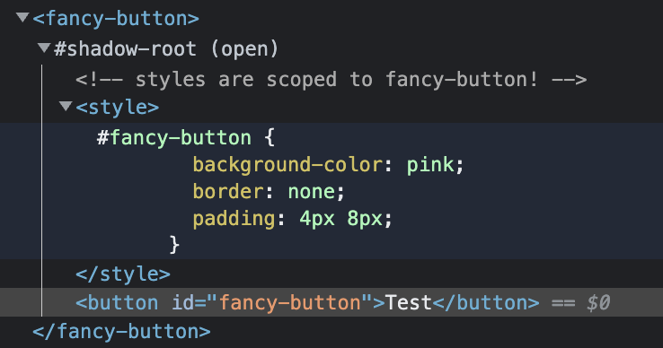
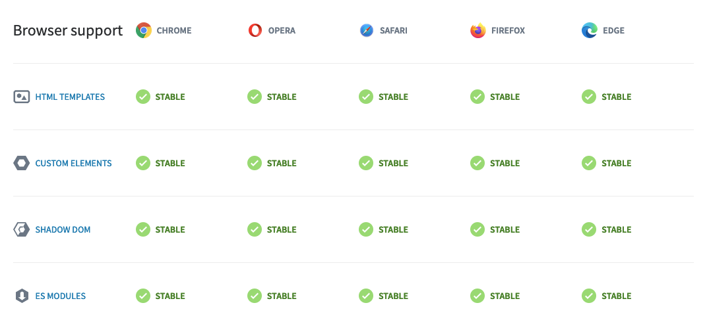

<!-- section-title: What is web component? -->

## What's web component?

#### Web components are a set of web platform APIs that allow you to create new custom, reusable, encapsulated **HTML tags** to use in web pages and web apps.

<div style={{ height: 24 }} />

-- [webcomponents.org](https://www.webcomponents.org/introduction#what-are-web-components-) --

<div style={{ height: 150 }} />

For example:

<div style={{ height: 24 }} />

<sp-switch emphasized value="on" checked>Switch Web Component</sp-switch>

```jsx
<script type="module" src="node_modules/@spectrum-web-components/switch/sp-switch.js"></script>

---

<sp-switch emphasized value="on" checked>
  Switch Web Component
</sp-switch>
```

<div style={{ height: 16 }} />

source: [spectrum - switch componet](https://opensource.adobe.com/spectrum-web-components/components/switch/)

---

<!-- classes: spesifications -->

## [Web Component Spesifications](https://www.webcomponents.org/specs)

There are four key specifications that define web components and enable their use in building web applications:

<div style={{ height: 24 }} />

<!-- fragments-start -->

##### 1. Custom Elements

##### 2. Shadow DOM

##### 3. ES Modules

##### 4. HTML Templates

<!-- fragments-end -->

---

### 1. Custom Elements

<div style={{ height: 32 }}></div>

It is a set of API spesification in the browser to create custom tag html.

<div style={{ height: 32 }}></div>

```javascript
class BeautifulButton extends HTMLElement {...}

window.customElements.define("beautiful-button", BeautifulButton);

---

<beautiful-button></beautiful-button>
```

<div style={{ height: 16 }} />

source: [web.dev - Custom Elements](https://web.dev/custom-elements-v1/)

---
<!-- classes: shadow-dom -->

### 2. Shadow DOM

The Shadow DOM is a web platform feature that provides **encapsulation** for web components. It allows you to create a separate DOM tree and style tree that are attached to a host element, and that are _isolated_ from the main document's DOM and style sheets.

<!-- fragments-start -->

It helps to **prevent conflicts** with the main document's styles and layout.

##### How to create Shadow DOM ([Element.attachShadow](https://developer.mozilla.org/en-US/docs/Web/API/Element/attachShadow))

```javascript
class FancyButton extends HTMLElement {
  constructor() {
    super();

    const shadowRoot = this.attachShadow({ mode: 'open' });
    shadowRoot.innerHTML = `
      <!-- styles are scoped to fancy-button! -->
      <style>#fancy-button { ... }</style>
      <button id="fancy-button">...</button>
    `;
  }
};
```

source: [web.dev - Shadow DOM](https://web.dev/shadowdom-v1/)

<!-- fragments-end -->

---

##### Example of Shadow DOM

<div style={{ height: 32 }}></div>

<fancy-button></fancy-button>

<div style={{ height: 24 }} />



---

### 3. ES Modules

<div style={{ height: 32 }}></div>

ES Modules enable web components to be developed in a **modular** way that is in alignment with other industry accepted implementations for JavaScript application development.

<div style={{ height: 32 }}></div>

```javascript
<script type="module" src="awesome-explosion.js"></script>

...

<script type="module">
  import 'awesome-explosion.js';
  ...
  import {awesomeExplosion} from '@awesome-things/awesome-explosion';
</script>
```

<div style={{ height: 16 }} />

source: [HTML Living Standard - ES Module](https://html.spec.whatwg.org/multipage/webappapis.html#integration-with-the-javascript-module-system)

---

### 4. HTML Templates

<div style={{ height: 32 }}></div>

Defines how to declare fragments of markup that go unused at page load, but can be instantiated later on at runtime, that can be cloned and inserted in the document by script

<div style={{ height: 20 }}></div>

Content between `<template></template>` tags

<div style={{ height: 12 }}></div>

- Will not render until it is activated
- Has no effect on other parts of the page - scripts won’t run, images won’t load, audio won’t play - until activated
- Will not appear in the DOM

<div style={{ height: 32 }}></div>

source: [webcomponents.org - Template Elements](https://www.webcomponents.org/specs#the-html-template-specification)

---

##### Example usage of Template Elements

<div style={{ height: 32 }}></div>

Declare a template:

```html
<template id="mytemplate">
  
  <div class="comment"></div>
</template>
```

<div style={{ height: 32 }}></div>

Use the template:

```javascript
var t = document.querySelector('#mytemplate');
// Populate the src at runtime.
t.content.querySelector('img').src = 'logo.png';

var clone = document.importNode(t.content, true);
document.body.appendChild(clone);
```

---

## Browser Support

<!-- classes: browser-support -->



<div style={{ height: 32 }}></div>

<!-- fragments-start -->

#### Use Polyfills

```bash
npm install @webcomponents/webcomponentsjs
```

```javascript
// load webcomponents bundle, which includes all the necessary polyfills
<script src="node_modules/@webcomponents/webcomponentsjs/webcomponents-bundle.js"></script>

// load the element
<script type="module" src="my-element.js"></script>

// use the element
<my-element></my-element>
```

For more detail: [webcomponents.org/polyfills](https://www.webcomponents.org/polyfills)

<!-- fragments-end -->